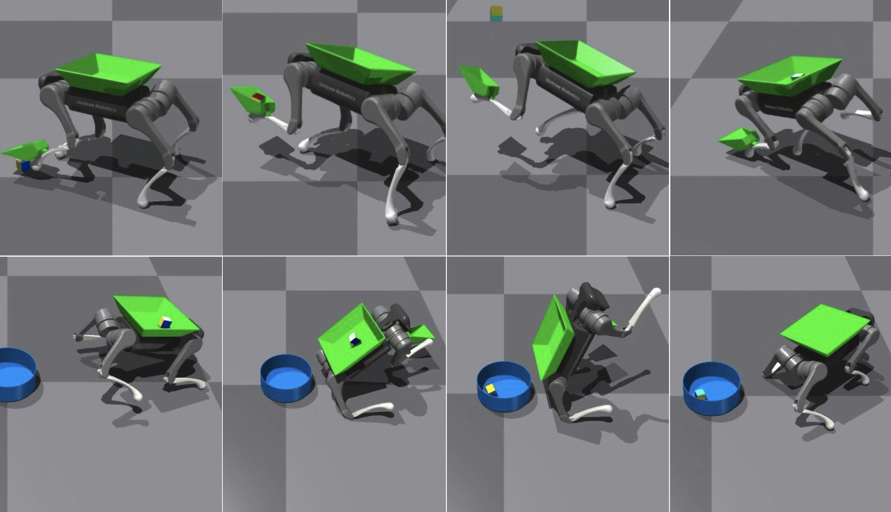

<!-- One -->
<section id="one">
	

		

<h2>Chanwoo Baek</h2>

B.S in Computer Science and Engineering, Kwangwoon University, Seoul, Korea, Feb.2023 
M.S in Computer Science, Hanyang University, Seoul, Korea, Feb.2026 
Room No. 702, IT.BT Building 
e-mail: bcw0430@hanyang.ac.kr

<a target="_blank" rel="noopener noreferrer" href="http://cs.hanyang.ac.kr/">Department Of Computer Science</a>
 
<a target="_blank" rel="noopener noreferrer" href="https://www.hanyang.ac.kr/">Hanyang University</a>

	

</section>

<h2 style="clear: both; padding-top: 20px;">Research Interests</h2>
Robot Learning for Legged Robots  
Sim-to-Real Transfer in Robotics   
Robust Locomotion and Manipulation  

<h2> Publications </h2>

 

<a target="_black" rel="noopener noreferrer" href="https://gitcgr.hanyang.ac.kr/publications/domestic/2025-kcgs-ScoopTossDump.pdf">삽 기반 조작 동작과 메타 정책을 통한 사족보행 로봇의 물체 수집 전략 학습</a> 
백찬우, 이윤상 
한국컴퓨터그래픽스학회 2025년 학술대회 논문집, 101-102, 2025.07. 

 

