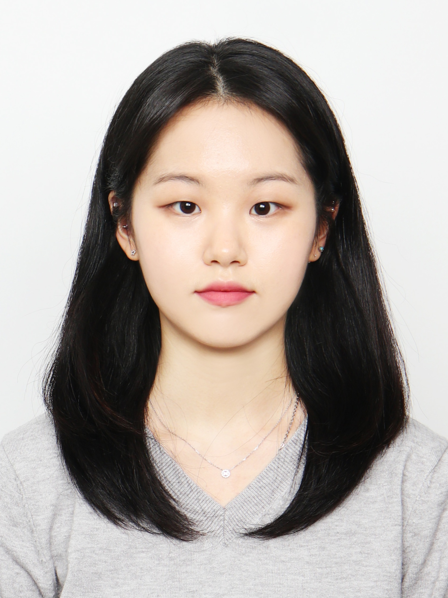

<!-- One -->
<section id="one">
	

		

<h2>Kyungeon Byeon</h2>

B.S in Chemical Engineering and Materials Science, Ewha Womans University, Seoul, Korea, Feb.2021 
Room No. 702, IT.BT Building 
e-mail: byeon9980@hanyang.ac.kr

<a target="_blank" rel="noopener noreferrer" href="http://cs.hanyang.ac.kr/">Department Of Computer Science</a>
 
<a target="_blank" rel="noopener noreferrer" href="https://www.hanyang.ac.kr/">Hanyang University</a>

	

</section>

## Research Interests
Robotics Deployment 
Physics Based Character Control 
Deep Reinforcement Learning 
 
 

## Publications

<a target="_black" rel="noopener noreferrer" href="https://gitcgr.hanyang.ac.kr/publications/domestic/2026-kcgs-quadruped-skateboarding.pdf">비디오 생성 모델 기반 레퍼런스 합성을 통한 4족 로봇의 스케이트보딩 동작 학습</a>
 
변경언, 권태수, 이윤상 
한국컴퓨터그래픽스학회 2026년 학술대회 논문집, 99-100, 2026.07.

 
 
