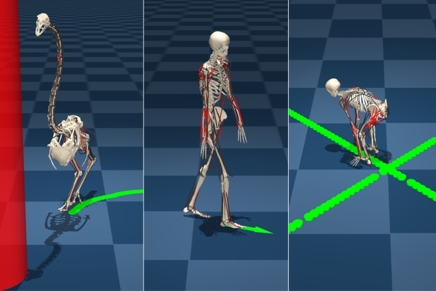
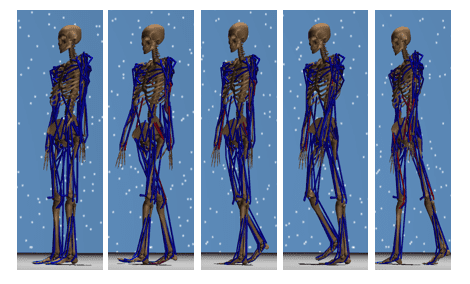

<!-- One -->
<section id="one">
	

		

<h2>Minkwan Kim</h2>

B.S in Computer Science, Hanyang University, Seoul, Korea, Feb.2021 
M.S in Computer Science, Hanyang University, Seoul, Korea, Aug.2023 
Room 702, IT.BT Building 
e-mail: palkan21@hanyang.ac.kr

<a target="_blank" rel="noopener noreferrer" href="http://cs.hanyang.ac.kr/">Department Of Computer Science</a>
 
<a target="_blank" rel="noopener noreferrer" href="https://www.hanyang.ac.kr/">Hanyang University</a>

	

</section>

## Research Interests
Physically-Based Character Control
 Deep Neural Network
 
 
 
## Publications 
<!--**[FreeMusco: Motion-Free Learning of Latent Control for Morphology-Adaptive Locomotion in Musculoskeletal Characters](https://cgrhyu.github.io/publications/2025-freemusco.html)** 
김민관, 이윤상 
To Appear in SIGGRAPH Asia 2025. 
 
**[인체 근골격 모델의 현실적인 보행 동작 생성을 위한 평균 상태 손실 함수를 이용하는 모델 기반 강화학습](https://gitcgr.hanyang.ac.kr/publications/domestic/2024-kcgs-AverageStateMusculoSkeletalLocomotion.pdf)** 
김민관, 이윤상 
한국컴퓨터그래픽스학회 2024년 학술대회 논문집, 40-41, 2024.07.  
 
**[Learning Human-like Locomotion Based on Biological Actuation and Rewards](https://cgrhyu.github.io/publications/2023-learning-human-like.html)** 
김민관, 이윤상 
SIGGRAPH '23: ACM SIGGRAPH 2023 Posters, Article No.: 5, July 2023 
 
**[참조 모션을 사용하지 않는 근골격계 캐릭터의 보행 모션 학습](https://gitcgr.hanyang.ac.kr/publications/domestic/2022-kcgs-NoRefMusculoSkeletalLocomotion.pdf)** 
김민관, 이윤상 
한국컴퓨터그래픽스학회 2022년 학술대회 논문집, 61-62, 2022.07. 
 -->

 

<!--<a target="_black" rel="noopener noreferrer" href="https://cgrhyu.github.io/publications/2025-freemusco.html">[FreeMusco: Motion-Free Learning of Latent Control for Morphology-Adaptive Locomotion in Musculoskeletal Characters](https://cgrhyu.github.io/publications/2025-freemusco.html)</a> -->
<a target="_black" rel="noopener noreferrer" href="https://cgrhyu.github.io/publications/2025-freemusco.html">FreeMusco: Motion-Free Learning of Latent Control for Morphology-Adaptive Locomotion in Musculoskeletal Characters</a> 
Minkwan Kim, Yoonsang Lee 
To Appear in SIGGRAPH Asia 2025. 

 

  

<a target="_black" rel="noopener noreferrer" href="https://gitcgr.hanyang.ac.kr/publications/domestic/2024-kcgs-AverageStateMusculoSkeletalLocomotion.pdf">인체 근골격 모델의 현실적인 보행 동작 생성을 위한 평균 상태 손실 함수를 이용하는 모델 기반 강화학습</a> 
김민관, 이윤상 
한국컴퓨터그래픽스학회 2024년 학술대회 논문집, 40-41, 2024.07.  

 

 

<a target="_black" rel="noopener noreferrer" href="https://cgrhyu.github.io/publications/2023-learning-human-like.html">Learning Human-like Locomotion Based on Biological Actuation and Rewards</a> 
Minkwan Kim, Yoonsang Lee 
SIGGRAPH '23: ACM SIGGRAPH 2023 Posters, Article No.: 5, July 2023 

 

  

<a target="_black" rel="noopener noreferrer" href="https://gitcgr.hanyang.ac.kr/publications/domestic/2022-kcgs-NoRefMusculoSkeletalLocomotion.pdf">참조 모션을 사용하지 않는 근골격계 캐릭터의 보행 모션 학습</a> 
김민관, 이윤상 
한국컴퓨터그래픽스학회 2022년 학술대회 논문집, 61-62, 2022.07.  

 

