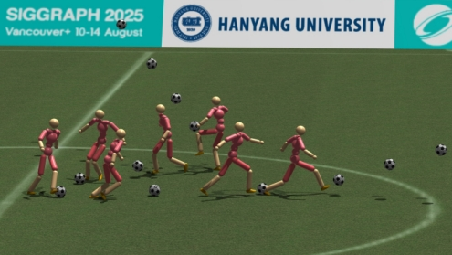
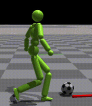
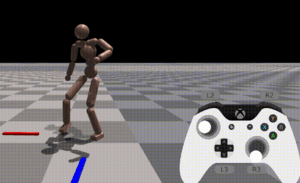

<!-- One -->
<section id="one">
	

		

<h2>Minsu Kim</h2>

B.S in Mechanical Information Engineering, University Of Seoul, Seoul, Korea, Aug.2019 
Room No. 702, IT.BT Building 
e-mail: igotaspot426@gmail.com

<a target="_blank" rel="noopener noreferrer" href="https://nextai.hanyang.ac.kr/">Department Of Artificial Intelligent</a>
 
<a target="_blank" rel="noopener noreferrer" href="https://www.hanyang.ac.kr/">Hanyang University</a>

	

</section>

## Research Interests
Physics Based Character Control 
Deep Reinforcement Learning 
Multi Agent Reinforcement Learning 

 
 
 
## Publications

 

<a target="_black" rel="noopener noreferrer" href="https://cgrhyu.github.io/publications/2025-physicsfc.html">PhysicsFC: Learning User-Controlled Skills for a Physics-Based Football Player Controller</a> 
Minsu Kim, Eunho Jung, Yoonsang Lee 
ACM Transactions on Graphics (SIGGRAPH 2025), August 2025 

 

 

<a target="_black" rel="noopener noreferrer" href="https://gitcgr.hanyang.ac.kr/publications/domestic/2024-kcgs-dribble.pdf">물리기반 캐릭터의 축구 드리블 스킬 학습</a> 
김민수, 이윤상  
한국컴퓨터그래픽스학회 2024년 학술대회 논문집, 55-56, 2024.07. 

 

 

<a target="_black" rel="noopener noreferrer" href="https://gitcgr.hanyang.ac.kr/publications/domestic/2024-kcgs-latent-matching.pdf">시뮬레이션 되는 휴머노이드 컨트롤을 위한 잠재변수 매칭</a> 
김민수, 이윤상  
한국컴퓨터그래픽스학회 2024년 학술대회 논문집, 42-43, 2024.07. 

