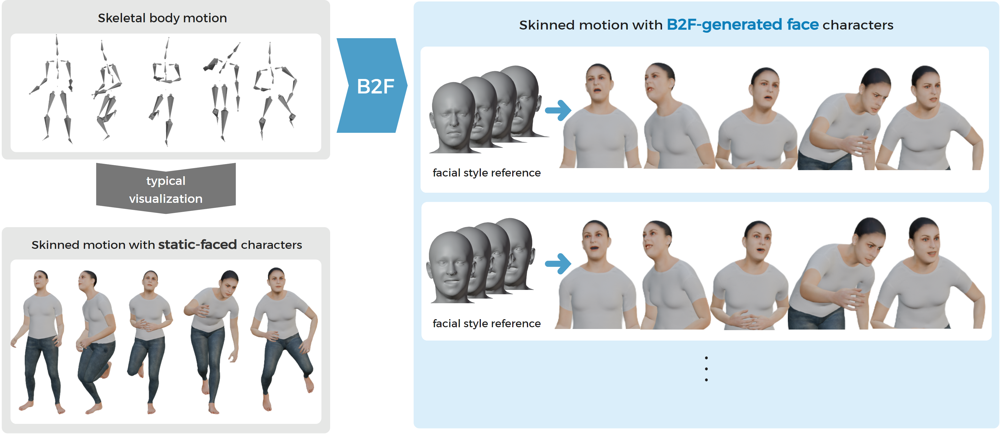

	Pacific Graphics 2025

  <a href="../people/bokyeong-jang.html">Bokyung Jang</a>
  <a href="../people/eunho-jung.html">Eunho Jung</a>
  <a href="../people/yoonsang-lee.html">Yoonsang Lee</a>

 
    Hanyang University

  <a href="https://diglib.eg.org/items/93f81df9-1fa7-4ce4-b1f9-916c145d81e6" rel="noopener noreferrer" target="_blank" class="button icon">
    
    Publisher
  </a>

  <a href="https://arxiv.org/abs/2511.13988" rel="noopener noreferrer" target="_blank" class="button icon">
    
    arXiv 
  </a>

  <a href="https://gitcgr.hanyang.ac.kr/publications/2025-b2f/18_B2F_End-to-End Body-to-Face Motion Generation with Style Reference.pdf" rel="noopener noreferrer" target="_blank" class="button icon">
    
    Slides (PDF)
  </a>

  <a href="https://gitcgr.hanyang.ac.kr/publications/2025-b2f/18_B2F_End-to-End Body-to-Face Motion Generation with Style Reference.pptx" rel="noopener noreferrer" target="_blank" class="button icon">
    
    Slides (PPTX)
  </a>

  <a href="" rel="noopener noreferrer" target="_blank" class="button icon">
    
    Code (coming soon)
  </a>

<!--[Bokyung Jang](../people/bokyeong-jang.html), [Eunho Jung](../people/eunho-jung.html), [Yoonsang Lee](../people/yoonsang-lee.html)  -->
<!--To appear in -->

  
*B2F generates facial expressions that align with body motions, enhancing the cohesiveness of character animation. Conditioned on a style reference, it produces diverse and expressive facial motions.*

## Video 

 

<iframe width="682" height="384" src="https://www.youtube.com/embed/NoPo_jsLy5A" title="B2F: End-to-End Body-to-Face Motion Generation with Style Reference" frameborder="0" allow="accelerometer; autoplay; clipboard-write; encrypted-media; gyroscope; picture-in-picture; web-share" referrerpolicy="strict-origin-when-cross-origin" allowfullscreen></iframe>

  
 

## Abstract
Human motion naturally integrates body movements and facial expressions, forming a unified perception.
If a virtual character’s facial expression does not align well with its body movements, it may weaken the perception of the character as a cohesive whole.
Motivated by this, we propose B2F, a model that generates facial motions aligned with body movements.
B2F takes a facial style reference as input, generating facial animations that reflect the provided style while maintaining consistency with the associated body motion.
To achieve this, B2F learns a disentangled representation of content and style, using alignment and consistency-based objectives.
We represent style using discrete latent codes learned via the Gumbel-Softmax trick, enabling diverse expression generation with a structured latent representation.
B2F outputs facial motion in the FLAME format, making it compatible with SMPL-X characters, and supports ARKit-style avatars through a dedicated conversion module.
Our evaluations show that B2F generates expressive and engaging facial animations that synchronize with body movements and style intent, while mitigating perceptual dissonance from mismatched cues, and generalizing across diverse characters and styles.

## Paper
Publisher: [page](https://diglib.eg.org/items/93f81df9-1fa7-4ce4-b1f9-916c145d81e6), [paper](https://diglib.eg.org/bitstreams/8627d824-9a82-4271-a27c-4eb14356be2a/download)\
arXiv: [page](https://arxiv.org/abs/2511.13988), [paper](https://arxiv.org/pdf/2511.13988)

## Presentation
Pacific Graphics 2025 Presentation Slides: [pdf](https://gitcgr.hanyang.ac.kr/publications/2025-b2f/18_B2F_End-to-End Body-to-Face Motion Generation with Style Reference.pdf) (4.1MB), [pptx](https://gitcgr.hanyang.ac.kr/publications/2025-b2f/18_B2F_End-to-End Body-to-Face Motion Generation with Style Reference.pptx) (170.9MB)

