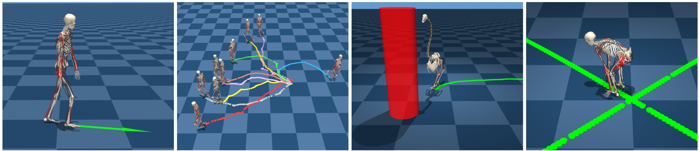

	SIGGRAPH Asia 2025

  <a href="../people/minkwan-kim.html">Minkwan Kim</a>
  <a href="../people/yoonsang-lee.html">Yoonsang Lee</a>

 
    Hanyang University

  <a href="" rel="noopener noreferrer" target="_blank" class="button icon">
    
    Publisher (coming soon)
  </a>

  <a href="https://arxiv.org/abs/2511.14205" rel="noopener noreferrer" target="_blank" class="button icon">
    
    arXiv  
  </a>

  <a href="" rel="noopener noreferrer" target="_blank" class="button icon">
  <!--<a href="https://gitcgr.hanyang.ac.kr/publications/2025-b2f/18_B2F_End-to-End Body-to-Face Motion Generation with Style Reference.pdf" rel="noopener noreferrer" target="_blank" class="button icon">-->
    
    Slides (PDF) (coming soon)
  </a>

  <a href="" rel="noopener noreferrer" target="_blank" class="button icon">
  <!--<a href="https://gitcgr.hanyang.ac.kr/publications/2025-b2f/18_B2F_End-to-End Body-to-Face Motion Generation with Style Reference.pptx" rel="noopener noreferrer" target="_blank" class="button icon">-->
    
    Slides (PPTX) (coming soon)
  </a>

  <a href="" rel="noopener noreferrer" target="_blank" class="button icon">
    
    Code (coming soon)
  </a>

<!--[Minkwan Kim](../people/minkwan-kim.html), [Yoonsang Lee](../people/yoonsang-lee.html)  -->
<!--To appear in SIGGRAPH Asia 2025-->

  
*FreeMusco is a motion-free framework that learns a latent representation of morphology-adaptive locomotion from musculoskeletal simulation, without motion data. The learned latent space enables high-level control for downstream tasks such as goal navigation and path following. The figure shows: (1) Humanoid locomotion control, (2) diverse motions sampled from the latent space, (3) goal navigation with Ostrich, and (4) path following with Chimanoid.*

<!--
## Abstract
We propose FreeMusco, a motion-free framework that jointly learns latent representations and control policies for musculoskeletal characters. By leveraging the musculoskeletal model as a strong prior, our method enables energy-aware and morphology-adaptive locomotion to emerge without motion data. The framework generalizes across human, non-human, and synthetic morphologies, where distinct energy-efficient strategies naturally appear—for example, quadrupedal gaits in Chimanoid versus bipedal gaits in Humanoid. The latent space and corresponding control policy are constructed from scratch, without demonstration, and enable downstream tasks such as goal navigation and path following—representing, to our knowledge, the first motion-free method to provide such capabilities. FreeMusco learns diverse and physically plausible locomotion behaviors through model-based reinforcement learning, guided by the locomotion objective that combines control, balancing, and biomechanical terms. To better capture the periodic structure of natural gait, we introduce a temporally averaged loss formulation, which compares simulated and target states over a time window rather than on a per-frame basis. We further encourage behavioral diversity by randomizing target poses and energy levels during training, enabling locomotion to be flexibly modulated in both form and intensity at runtime. Together, these results demonstrate that versatile and adaptive locomotion control can emerge without motion capture, offering a new direction for simulating movement in characters where data collection is impractical or impossible.

## System Overview
  
-->

<!--
<section class="fullwidth-section2">
  <h2>System Overview</h2>
  

    

      <h3 style="color: var(--black); margin-bottom: 12px; text-align: center;">Abstract</h3>
      

        We propose FreeMusco, a motion-free framework that jointly learns latent representations and control policies for musculoskeletal characters. By leveraging the musculoskeletal model as a strong prior, our method enables energy-aware and morphology-adaptive locomotion to emerge without motion data. The framework generalizes across human, non-human, and synthetic morphologies, where distinct energy-efficient strategies naturally appear—for example, quadrupedal gaits in Chimanoid versus bipedal gaits in Humanoid. The latent space and corresponding control policy are constructed from scratch, without demonstration, and enable downstream tasks such as goal navigation and path following—representing, to our knowledge, the first motion-free method to provide such capabilities. FreeMusco learns diverse and physically plausible locomotion behaviors through model-based reinforcement learning, guided by the locomotion objective that combines control, balancing, and biomechanical terms. To better capture the periodic structure of natural gait, we introduce a temporally averaged loss formulation, which compares simulated and target states over a time window rather than on a per-frame basis. We further encourage behavioral diversity by randomizing target poses and energy levels during training, enabling locomotion to be flexibly modulated in both form and intensity at runtime. Together, these results demonstrate that versatile and adaptive locomotion control can emerge without motion capture, offering a new direction for simulating movement in characters where data collection is impractical or impossible.
      

    

    

      

        
      

      

        
      

    

  

</section>
-->

<!-- test gif

  

     
    
<small>Human</small>
 
  

  

    
    
<small>Ostrich</small>

  

  

    
    
<small>Chimanoid</small>

  

-->
<!-- memo
<source src="../assets/publications/2025-freemusco/rev_ablation_ours_front_compressed.mp4" type="video/mp4">
<source src="https://gitcgr.hanyang.ac.kr/publications/2025-freemusco/ablation_updir_ours.mp4" type="video/mp4">
#1f77b4 light-blue #ff7f0e orange
-->

<!--
## Results
### Muscularskeletal Humanoid Locomotion

  

    <video width="100%" controls loop muted autoplay>
      <source src="https://gitcgr.hanyang.ac.kr/publications/2025-freemusco/.mp4" type="video/mp4">
      Your browser does not support the video tag.
    </video>
    
<small>Velocity Only</small>

  

  

    <video width="100%" controls loop muted autoplay>
      <source src="https://gitcgr.hanyang.ac.kr/publications/2025-freemusco/.mp4" type="video/mp4">
      Your browser does not support the video tag.
    </video>
    
<small>Velocity + Direction</small>

  

  

    <video width="100%" controls loop muted autoplay>
      <source src="https://gitcgr.hanyang.ac.kr/publications/2025-freemusco/.mp4" type="video/mp4">
      Your browser does not support the video tag.
    </video>
    
<small>Velocity + Pose + Energy</small>

  

### Morphology-Adaptive Locomotion

  

    <video width="100%" controls loop muted autoplay>
      <source src="https://gitcgr.hanyang.ac.kr/publications/2025-freemusco/.mp4" type="video/mp4">
      Your browser does not support the video tag.
    </video>
    
 Velocity & Direction 

  

  

    <video width="100%" controls loop muted autoplay>
      <source src="https://gitcgr.hanyang.ac.kr/publications/2025-freemusco/.mp4" type="video/mp4">
      Your browser does not support the video tag.
    </video>
    
 Velocity & Direction 

  

  

    <video width="100%" controls loop muted autoplay>
      <source src="https://gitcgr.hanyang.ac.kr/publications/2025-freemusco/.mp4" type="video/mp4">
      Your browser does not support the video tag.
    </video>
    
 Velocity & Direction 

  

-->

<section class="fullwidth-section">
  <h2>Humanoid Locomotion</h2>
  

    

      
 
        <iframe
          src="https://www.youtube.com/embed/DtPPea1EODw?autoplay=1&mute=1&loop=1&playlist=DtPPea1EODw" 
          style="position: absolute; top: 0; left: 0; width: 100%; height: 100%;" 
          frameborder="0"
          allow="autoplay; encrypted-media"
          allowfullscreen>
        </iframe>
      

      

        Goal Velocity-Only
      

    

    

      
 
        <iframe
          src="https://www.youtube.com/embed/H1zTPru_yPY?autoplay=1&mute=1&loop=1&playlist=H1zTPru_yPY" 
          style="position: absolute; top: 0; left: 0; width: 100%; height: 100%;" 
          frameborder="0"
          allow="autoplay; encrypted-media"
          allowfullscreen>
        </iframe>
      

      

        Goal Velocity + Direction
      

    

    

      
 
        <iframe
          src="https://www.youtube.com/embed/jFX2WJysYac?autoplay=1&mute=1&loop=1&playlist=jFX2WJysYac"  
          style="position: absolute; top: 0; left: 0; width: 100%; height: 100%;" 
          frameborder="0"
          allow="autoplay; encrypted-media"
          allowfullscreen>
        </iframe>
      

      

        Goal Velocity + Energy + Pose (symmetric)
      

    

    

      
 
        <iframe
          src="https://www.youtube.com/embed/-yUyC-40AHE?autoplay=1&mute=1&loop=1&playlist=-yUyC-40AHE"  
          style="position: absolute; top: 0; left: 0; width: 100%; height: 100%;" 
          frameborder="0"
          allow="autoplay; encrypted-media"
          allowfullscreen>
        </iframe>
      

      

        Goal Velocity + Energy + Pose (asymmetirc)
      

    

  

</section>

<section class="fullwidth-section2">
  <h2>Morphology-Adaptive Locomotion</h2>
  

    

      
 
        <iframe
          src="https://www.youtube.com/embed/vFqhSliXM24?autoplay=1&mute=1&loop=1&playlist=vFqhSliXM24" 
          style="position: absolute; top: 0; left: 0; width: 100%; height: 100%;" 
          frameborder="0"
          allow="autoplay; encrypted-media"
          allowfullscreen>
        </iframe>
      

      

        Chimanoid: Goal Velocity-Only
      

    

    

      
 
        <iframe
          src="https://www.youtube.com/embed/3SS7apL1dWQ?autoplay=1&mute=1&loop=1&playlist=3SS7apL1dWQ" 
          style="position: absolute; top: 0; left: 0; width: 100%; height: 100%;" 
          frameborder="0"
          allow="autoplay; encrypted-media" 
          allowfullscreen>
        </iframe>
      

      

        Ostrich: Goal Velocity-Only
      

    

    

      
 
        <iframe
          src="https://www.youtube.com/embed/lvtsGscn2Hc?autoplay=1&mute=1&loop=1&playlist=lvtsGscn2Hc"
          style="position: absolute; top: 0; left: 0; width: 100%; height: 100%;" 
          frameborder="0"
          allow="autoplay; encrypted-media"
          allowfullscreen>
        </iframe>
      

      

        Ostrich: Goal Velocity + Pose + Energy
      

    

  

</section>

<section class="fullwidth-section">
  <h2>Emergent Gait Strategies Across Morphologies</h2>
  

    

      
 
        <iframe
          src="https://www.youtube.com/embed/0kecrXYtuWU?autoplay=1&mute=1&loop=1&playlist=0kecrXYtuWU" 
          style="position: absolute; top: 0; left: 0; width: 100%; height: 100%;" 
          frameborder="0"
          allow="autoplay; encrypted-media"
          allowfullscreen>
        </iframe>
      

      

        Chimanoid: Goal Velocity + Energy
      

    

    

      
 
        <iframe
          src="https://www.youtube.com/embed/dUMsO8iHufA?autoplay=1&mute=1&loop=1&playlist=dUMsO8iHufA" 
          style="position: absolute; top: 0; left: 0; width: 100%; height: 100%;"
          frameborder="0"
          allow="autoplay; encrypted-media"
          allowfullscreen>
        </iframe>
      

      
 
        Humanoid: Goal Velocity + Energy
      

    

    

      

        If initialized in a bipedal pose, Chimanoid walks bipedally at high energy but shifts to a quadrupedal gait as energy decreases. 
        And when the energy is raised again, it does not return to bipedal walking but instead exhibits a stronger qudarupedal gait,
        indiciating quadrupedal motion is more efficient for its body. Humanoid, however, never adopts quadrupedal gaits—showing
        that energy-efficient strategies depend on morphology and can naturally emerge in our motion-free framework.
      

    

  

</section>

<section class="fullwidth-section2">
  <h2>Unconditional Random Sampling in Latent Space</h2>
  

    

      
 
        <iframe
          src="https://www.youtube.com/embed/T9i6hZIwuRY?autoplay=1&mute=1&loop=1&playlist=T9i6hZIwuRY" 
          style="position: absolute; top: 0; left: 0; width: 100%; height: 100%;"
          frameborder="0"
          allow="autoplay; encrypted-media"
          allowfullscreen>
        </iframe>
      

      

        Humanoid Latent Space   Trained with Velocity-Only Goals
      

    

    

      
 
        <iframe
          src="https://www.youtube.com/embed/h4vRzwobSuk?autoplay=1&mute=1&loop=1&playlist=h4vRzwobSuk"   
          style="position: absolute; top: 0; left: 0; width: 100%; height: 100%;"
          frameborder="0"
          allow="autoplay; encrypted-media"
          allowfullscreen>
        </iframe>
      

      

        Humanoid Latent Space   Trained with Velocity + Pose + Energy Goals
      

    

    

      
 
        <iframe
          src="https://www.youtube.com/embed/t8F7GiGLYlo?autoplay=1&mute=1&loop=1&playlist=t8F7GiGLYlo"  
          style="position: absolute; top: 0; left: 0; width: 100%; height: 100%;"
          frameborder="0"
          allow="autoplay; encrypted-media"
          allowfullscreen>
        </iframe>
      

      

        Chimanoid Latent Space   Trained with Velocity-Only Goals
      

    

    

      
 
        <iframe
          src="https://www.youtube.com/embed/61gtTT5rC5A?autoplay=1&mute=1&loop=1&playlist=61gtTT5rC5A"  
          style="position: absolute; top: 0; left: 0; width: 100%; height: 100%;"
          frameborder="0"
          allow="autoplay; encrypted-media"
          allowfullscreen>
        </iframe>
      

      

        Ostrich Latent Space   Trained with Velocity + Pose + Energy Goals
      

    

  

</section>

<section class="fullwidth-section">
  <h2>Downstream Tasks: Point-Goal Navigation</h2>
  

    

      
 
        <iframe
          src="https://www.youtube.com/embed/5TBRc0ojVas?autoplay=1&mute=1&loop=1&playlist=5TBRc0ojVas"  
          style="position: absolute; top: 0; left: 0; width: 100%; height: 100%;"
          frameborder="0"
          allow="autoplay; encrypted-media"
          allowfullscreen>
        </iframe>
      

      

        Humanoid
      

    

    

      
 
        <iframe
          src="https://www.youtube.com/embed/4-67VchDw1E?autoplay=1&mute=1&loop=1&playlist=4-67VchDw1E"  
          style="position: absolute; top: 0; left: 0; width: 100%; height: 100%;"
          frameborder="0"
          allow="autoplay; encrypted-media"
          allowfullscreen>
        </iframe>
      

      

        Chimanoid
      

    

    

      
 
        <iframe
          src="https://www.youtube.com/embed/dX-QdRzvEtY?autoplay=1&mute=1&loop=1&playlist=dX-QdRzvEtY" 
          style="position: absolute; top: 0; left: 0; width: 100%; height: 100%;" 
          frameborder="0"
          allow="autoplay; encrypted-media"
          allowfullscreen>
        </iframe>
      

      

        Ostrich
      

    

  

</section>

<section class="fullwidth-section2">
  <h2>Downstream Tasks: Path Following</h2>
  

    

      
 
        <iframe
          src="https://www.youtube.com/embed/QH8ilQQaTRw?autoplay=1&mute=1&loop=1&playlist=QH8ilQQaTRw" 
          style="position: absolute; top: 0; left: 0; width: 100%; height: 100%;"
          frameborder="0"
          allow="autoplay; encrypted-media"
          allowfullscreen>
        </iframe>
      

      

        Humanoid
      

    

    

      
 
        <iframe
          src="https://www.youtube.com/embed/uWwg47TXzjs?autoplay=1&mute=1&loop=1&playlist=uWwg47TXzjs" 
          style="position: absolute; top: 0; left: 0; width: 100%; height: 100%;"
          frameborder="0"
          allow="autoplay; encrypted-media"
          allowfullscreen>
        </iframe>
      

      

        Chimanoid
      

    

  

</section>

<section class="fullwidth-section">
  <h2>Method </h2>
  

    

      
      

        System Overview
      

    

    

      
      

        Locomotion Objective Loss
      

    

    

      

        FreeMusco builds on conditional VAE and model-based RL, guided by the locomotion objective loss with temporally averaged terms, to learn
        energy-aware latent locomotion directly from muscle dynamics and goal signals without motion data.
      

    

  

</section>

<section class="fullwidth-section2">
  <h2>Effect of Temporally Averaged Loss Formulation</h2>
  

    

      

        <iframe
          src="https://www.youtube.com/embed/miqnPb9hEEE?autoplay=1&mute=1&loop=1&playlist=miqnPb9hEEE" 
          style="position: absolute; top: 0; left: 0; width: 100%; height: 100%;"
          frameborder="0"
          allow="autoplay; encrypted-media"
          allowfullscreen>
        </iframe>
      

      

        Temporally-averaged Lpose (Ours)
      

    

    

      

        <iframe
          src="https://www.youtube.com/embed/nQd02C6xftA?autoplay=1&mute=1&loop=1&playlist=nQd02C6xftA" 
          style="position: absolute; top: 0; left: 0; width: 100%; height: 100%;"
          frameborder="0"
          allow="autoplay; encrypted-media"
          allowfullscreen>
        </iframe>
      

      

        Per-step Lpose
      

    

    

      

        <iframe
          src="https://www.youtube.com/embed/Mn6ZEFCjtZE?autoplay=1&mute=1&loop=1&playlist=Mn6ZEFCjtZE" 
          style="position: absolute; top: 0; left: 0; width: 100%; height: 100%;" 
          frameborder="0"
          allow="autoplay; encrypted-media"
          allowfullscreen>
        </iframe>
      

      

        Temporally-averaged Lup (Ours)
      

    

    

      

        <iframe
          src="https://www.youtube.com/embed/SoFYlazzQdM?autoplay=1&mute=1&loop=1&playlist=SoFYlazzQdM"
          style="position: absolute; top: 0; left: 0; width: 100%; height: 100%;"
          frameborder="0"
          allow="autoplay; encrypted-media"
          allowfullscreen>
        </iframe>
      

      

        Per-step Lup
      

    

    

      

        (1) Per-step enforces rigid frame-level pose matching, leading to slightly crouched, short-stepped gait with suppressed pelvic rotation.
          (2) Per-step strongly constrains pelvic dynamics, so pelvic rotation appears nearly rigid without natural oscillatory components.
      

    

  

</section>

<section class="fullwidth-section">
  <h2>Comparison with Torque-Actuated Humanoid</h2>
  

    

      

        <iframe
          src="https://www.youtube.com/embed/5MfxHva0FCg?autoplay=1&mute=1&loop=1&playlist=5MfxHva0FCg"
          style="position: absolute; top: 0; left: 0; width: 100%; height: 100%;"
          frameborder="0"
          allow="autoplay; encrypted-media"
          allowfullscreen>
        </iframe>
      

      

        Muscle-Actuated (Ours)
      

    

    

      

        <iframe
          src="https://www.youtube.com/embed/XTT0r_96Xik?autoplay=1&mute=1&loop=1&playlist=XTT0r_96Xik" 
          style="position: absolute; top: 0; left: 0; width: 100%; height: 100%;"
          frameborder="0"
          allow="autoplay; encrypted-media"
          allowfullscreen>
        </iframe>
      

      

        Torque-Actuated 
      

    

    

      

        <iframe
          src="https://www.youtube.com/embed/A1iyknW-Y4s?autoplay=1&mute=1&loop=1&playlist=A1iyknW-Y4s"  
          style="position: absolute; top: 0; left: 0; width: 100%; height: 100%;"
          frameborder="0"
          allow="autoplay; encrypted-media"
          allowfullscreen>
        </iframe>
      

      

        Torque-Actuated  (with manually tuned torque limits)
      

    

    

      

        Torque-actuated humanoid failed to learn even basic balanced walking behavior. Even with
        manual tuning of joint torque limits, it only learned a very short-stepped, high-frequency locomotion.
      

    

  

</section>

<section class="fullwidth-section2">
  <h2>Discussion</h2>
  

    

      

        <iframe
          src="https://www.youtube.com/embed/5MfxHva0FCg?autoplay=1&mute=1&loop=1&playlist=5MfxHva0FCg"
          style="position: absolute; top: 0; left: 0; width: 100%; height: 100%;"
          frameborder="0"
          allow="autoplay; encrypted-media"
          allowfullscreen>
        </iframe>
      

      

        Target Pose:  Standing pose with straight arms 
      

    

    

      

        <iframe
          src="https://www.youtube.com/embed/PWkwiGMc0sw?autoplay=1&mute=1&loop=1&playlist=PWkwiGMc0sw"
          style="position: absolute; top: 0; left: 0; width: 100%; height: 100%;"
          frameborder="0"
          allow="autoplay; encrypted-media"
          allowfullscreen>
        </iframe>
      

      

        Target Pose:  Standing pose with slightly bent elbows 
      

    

    

      

        Learning with target poses featuring slightly bent elbows mitigates the straight and stiff arm artifact, suggesting
        that searching for optimal target poses would be a valuable direction for future work.
      

    

  

</section>

  

## Abstract
We propose FreeMusco, a motion-free framework that jointly learns latent representations and control policies for musculoskeletal characters. By leveraging the musculoskeletal model as a strong prior, our method enables energy-aware and morphology-adaptive locomotion to emerge without motion data. The framework generalizes across human, non-human, and synthetic morphologies, where distinct energy-efficient strategies naturally appear—for example, quadrupedal gaits in Chimanoid versus bipedal gaits in Humanoid. The latent space and corresponding control policy are constructed from scratch, without demonstration, and enable downstream tasks such as goal navigation and path following—representing, to our knowledge, the first motion-free method to provide such capabilities. FreeMusco learns diverse and physically plausible locomotion behaviors through model-based reinforcement learning, guided by the locomotion objective that combines control, balancing, and biomechanical terms. To better capture the periodic structure of natural gait, we introduce a temporally averaged loss formulation, which compares simulated and target states over a time window rather than on a per-frame basis. We further encourage behavioral diversity by randomizing target poses and energy levels during training, enabling locomotion to be flexibly modulated in both form and intensity at runtime. Together, these results demonstrate that versatile and adaptive locomotion control can emerge without motion capture, offering a new direction for simulating movement in characters where data collection is impractical or impossible.

## Video 

 

<iframe width="1198" height="674" src="https://www.youtube.com/embed/YFNKLzUQ0zk" title="FreeMusco: Motion-Free Learning of Latent Control for Morphology-Adaptive Locomotion in Musculoske.." frameborder="0" allow="accelerometer; autoplay; clipboard-write; encrypted-media; gyroscope; picture-in-picture; web-share" referrerpolicy="strict-origin-when-cross-origin" allowfullscreen></iframe>

  
 

## Paper
Publisher: Coming soon  
<!--Publisher: [page](https://dl.acm.org/doi/10.1145/3731425), [paper](https://dl.acm.org/doi/pdf/10.1145/3731425)\-->
arXiv: [page](https://arxiv.org/abs/2511.14205), [paper](https://arxiv.org/pdf/2511.14205)
<!--arXiv: Coming soon-->

<!--## Presentation & Poster-->
<!--SIGGRAPH 2025 Technical Papers Presentation Slides: [pdf](https://gitcgr.hanyang.ac.kr/publications/2025-physicsfc/physicsfc-siggraph-presentation.pdf) (3.5MB), [pptx](https://gitcgr.hanyang.ac.kr/publications/2025-physicsfc/physicsfc-siggraph-presentation.pptx) (369.7MB)  -->
<!--SIGGRAPH 2025 Emerging Technologies & Interactive Discussion Poster: [pdf](https://gitcgr.hanyang.ac.kr/publications/2025-physicsfc/physicsfc-etech-intdis-poster.pdf) (523KB)-->

