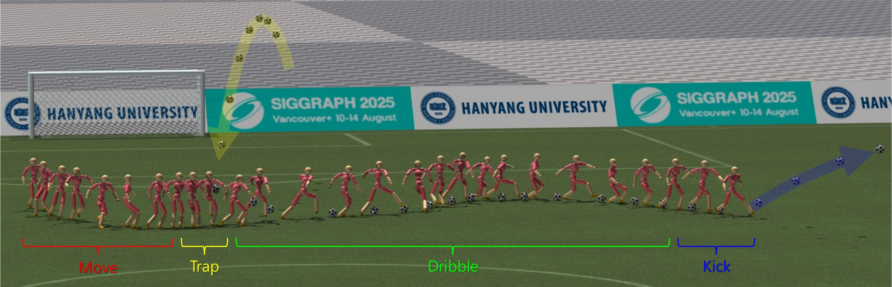

[Minsu Kim](../people/minsu-kim.html), [Eunho Jung](../people/eunho-jung.html), [Yoonsang Lee](../people/yoonsang-lee.html)  
ACM Transactions on Graphics (TOG), Volume 44, Issue 4,  Article No.: 130, July 2025 (Presented at SIGGRAPH 2025)

  
*With PhysicsFC, users can control a character in a physics-simulated environment, where both the character and the ball are simulated, to perform various football skills–such as moving, trapping, dribbling, and kicking–and seamlessly transition between them.*

## Abstract
We propose PhysicsFC, a method for controlling physically simulated football player characters to perform a variety of football skills--such as dribbling, trapping, moving, and kicking--based on user input, while seamlessly transitioning between these skills. Our skill-specific policies, which generate latent variables for each football skill, are trained using an existing physics-based motion embedding model that serves as a foundation for reproducing football motions. Key features include a tailored reward design for the Dribble policy, a two-phase reward structure combined with projectile dynamics-based initialization for the Trap policy, and a Data-Embedded Goal-Conditioned Latent Guidance (DEGCL) method for the Move policy. Using the trained skill policies, the proposed football player finite state machine (PhysicsFC FSM) allows users to interactively control the character. To ensure smooth and agile transitions between skill policies, as defined in the FSM, we introduce the Skill Transition-Based Initialization (STI), which is applied during the training of each skill policy. We develop several interactive scenarios to showcase PhysicsFC's effectiveness, including competitive trapping and dribbling, give-and-go plays, and 11v11 football games, where multiple PhysicsFC agents produce natural and controllable physics-based football player behaviors. Quantitative evaluations further validate the performance of individual skill policies and the transitions between them, using the presented metrics and experimental designs. 

## Paper
Publisher: [page](https://dl.acm.org/doi/10.1145/3731425), [paper](https://dl.acm.org/doi/pdf/10.1145/3731425)\
arXiv: [page](https://arxiv.org/abs/2504.21216), [paper](https://arxiv.org/pdf/2504.21216)

## Video 

 

<iframe width="896" height="504" src="https://www.youtube.com/embed/dSfW8EvV5CA" title="PhysicsFC: Learning User-Controlled Skills for a Physics-Based Football Player Controller" frameborder="0" allow="accelerometer; autoplay; clipboard-write; encrypted-media; gyroscope; picture-in-picture; web-share" referrerpolicy="strict-origin-when-cross-origin" allowfullscreen></iframe>

  

 

## Presentation & Poster
SIGGRAPH 2025 Technical Papers Presentation Slides: [pdf](https://gitcgr.hanyang.ac.kr/publications/2025-physicsfc/physicsfc-siggraph-presentation.pdf) (3.5MB), [pptx](https://gitcgr.hanyang.ac.kr/publications/2025-physicsfc/physicsfc-siggraph-presentation.pptx) (369.7MB)  
SIGGRAPH 2025 Emerging Technologies & Interactive Discussion Poster: [pdf](https://gitcgr.hanyang.ac.kr/publications/2025-physicsfc/physicsfc-etech-intdis-poster.pdf) (523KB)

