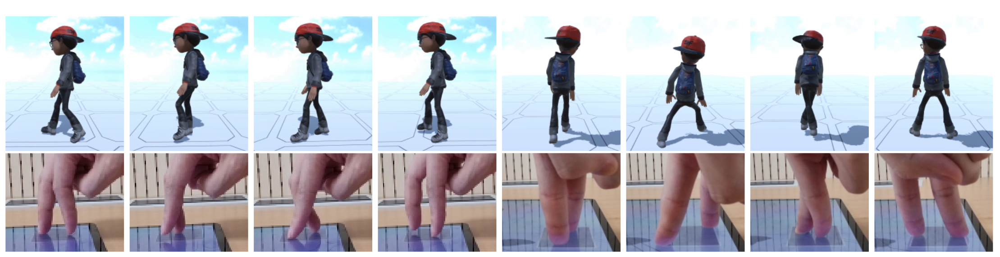

[Geuntae Park](../people/geuntae-park.html), [Jiwon Yi](../people/jiwon-yi.html), [Taehyun Rhee](https://findanexpert.unimelb.edu.au/profile/1084098-taehyun-rhee), [Kwanguk Kim](http://hcilab.dothome.co.kr/professor/166), [Yoonsang Lee](../people/yoonsang-lee.html)  
To appear in 2025 IEEE International Symposium on Mixed and Augmented Reality (ISMAR 2025)

  
*TouchWalker enables real-time control of full-body avatar locomotion using finger walking on a touchscreen. Users specify foot contacts within a touch region overlaid on the screen (bottom), and the system generates responsive full-body locomotion (top).*

## Abstract
 We present TouchWalker, a real-time system for controlling full-body avatar locomotion using finger-walking gestures on a touchscreen. The system comprises two main components: TouchWalker-MotionNet, a neural motion generator that synthesizes full-body avatar motion on a per-frame basis from temporally sparse two-finger input, and TouchWalker-UI, a compact touch interface that interprets user touch input to avatar-relative foot positions. Unlike prior systems that rely on symbolic gesture triggers or predefined motion sequences, TouchWalker uses its neural component to generate continuous, context-aware full-body motion on a per-frame basis—including airborne phases such as running, even without input during mid-air steps—enabling more expressive and immediate interaction. To ensure accurate alignment between finger contacts and avatar motion, it employs a MoE-GRU architecture with a dedicated foot-alignment loss. We evaluate TouchWalker in a user study comparing it to a virtual joystick baseline with predefined motion across diverse locomotion tasks. Results show that TouchWalker improves users’ sense of embodiment, enjoyment, and immersion.

## Paper
Publisher: Coming soon\
arXiv: Coming soon\
<!--Publisher link: [ArXiv](https://arxiv.org/abs/2403.15902)\-->
<!--arXiv: [page](https://arxiv.org/abs/2504.21216), [paper](https://arxiv.org/pdf/2504.21216)-->

## Video 

 

<iframe width="640" height="360" src="https://www.youtube.com/embed/RO8SRQUstoI" title="TouchWalker: Real-Time Avatar Locomotion from Touchscreen Finger Walking" frameborder="0" allow="accelerometer; autoplay; clipboard-write; encrypted-media; gyroscope; picture-in-picture; web-share" referrerpolicy="strict-origin-when-cross-origin" allowfullscreen></iframe>

  

 

<!--
## Slides
Eurographics 2024 presentation slides: [pdf](https://gitcgr.hanyang.ac.kr/publications/2024-matching-drl/Eurographics-PP-short1002.pdf) (1.5MB), [pptx](https://gitcgr.hanyang.ac.kr/publications/2024-matching-drl/Eurographics-PP-short1002.pptx) (289.5MB)
-->
